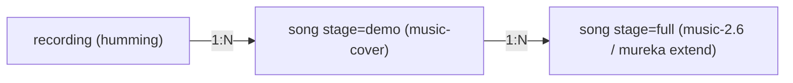

# demo2song:完整版生成 / 下载分享 / 我的音频

## 决策结论(已与你确认)

- demo 用 `music-cover`,跟随哼唱旋律,**时长跟随哼唱**(UI 文案改为"约 X 秒"),不强求 30 秒。这也是 12 秒问题的根因与处理方式。
- 完整版可配置两条路径:默认 `minimax` 用 `music-2.6` 以录音为风格参考"重生成"完整歌;`mureka` 可用时走真实 `extend`(续写 demo)。
- 下载:`wx.downloadFile` + `saveFileToDisk`/文件系统,失败回退转发;分享走小程序转发卡片 + 公开试听落地页。
- 血缘:录音 1→N demo、demo 1→N 完整版(本版本不提供"录音再生成新 demo"的入口)。

## 数据血缘与 COS 结构

COS 目录改为按血缘组织(MVP 直接切换,无需迁移):

- `recordings/{userId}/{recordingId}.{ext}`
- `songs/{userId}/{recordingId}/demo/{songId}.mp3`
- `songs/{userId}/{recordingId}/full/{songId}.mp3`

DB 字段已基本够用:[packages/data/src/types.ts](packages/data/src/types.ts) 的 `SongRecord` 已有 `recordingId`(→录音)、`parentSongId`(→demo)、`prompt`(完整版存自己改过的补充信息)。新增仓储查询方法即可。

## Phase 1 · 数据层

- [packages/data/src/types.ts](packages/data/src/types.ts):`Demo2SongRepository` 增加
  - `listSongsForUser(userId)`、`listFullSongsForDemo(demoId, userId)`、`countReadyFullForDemo(demoId)`。
- 在 [packages/data/src/cloudbase.ts](packages/data/src/cloudbase.ts) 与 [packages/data/src/memory.ts](packages/data/src/memory.ts) 实现(cloudbase 用 `where().orderBy('createdAt','desc')`)。
- 将 `SongJobKind` 的 `"extend"` 重命名为 `"full"`(语义更清晰):[packages/shared/src/types.ts](packages/shared/src/types.ts) 及引用处。

## Phase 2 · Provider / Worker

- Provider 契约 [packages/shared/src/provider.ts](packages/shared/src/provider.ts):把 `extendSong` 调整为 `createFullSong(input)`,入参同时带 `recording` 与可选 `demoSong`,由各 provider 自行选择路径。
- [apps/worker/src/providers/minimax.ts](apps/worker/src/providers/minimax.ts):
  - `createDemoSong` 用 `demoModel=music-cover`(`audio_url`=录音,跟随旋律)。
  - `createFullSong` 用 `fullModel=music-2.6`(`audio_url`=录音作风格参考 + `lyrics`,输出完整歌)。
  - `getCapabilities().supportsSongExtend=false`(走重生成)。
- [apps/worker/src/providers/mureka.ts](apps/worker/src/providers/mureka.ts):`createFullSong` 内部走 `/v1/song/extend`(续写 demo 音频),`supportsSongExtend=true`。
- [apps/worker/src/worker.ts](apps/worker/src/worker.ts):
  - `kind==="demo"` → `createDemoSong`(录音);`kind==="full"` → `createFullSong`(传录音+demo 音频,provider 自选)。
  - `objectKey` 改为新血缘结构。demo 不再裁剪,`durationSeconds` 用 provider 返回值。
- 更新 [apps/worker/src/providers/provider.test.ts](apps/worker/src/providers/provider.test.ts)。

## Phase 3 · API

- [apps/api/src/routes/songs.ts](apps/api/src/routes/songs.ts):
  - `POST /songs/:demoId/full-jobs`(取代 extend-jobs):body 可带 `prompt`(与 demo.prompt 合并,允许改补充信息),重新 `expandLyrics`,配额用 `dailyExtendJobsPerUser`,kind=`full`,`parentSongId=demoId`。
  - `GET /songs`(我的):返回 `{ demos: 无 ready full 子的 demo, fullSongs }`,各为 brief。
  - `GET /songs/:id` 扩展:demo 附 `recordingPlaybackUrl`(听原录音)、`hasFull`;full 附 `parentDemoId`、`parentDemoPlaybackUrl`。
  - 新增公开只读 `GET /public/songs/:id`(无鉴权,返回 title/stage/durationSeconds/lyrics/playbackUrl,供分享落地页)。在 [apps/api/src/app.ts](apps/api/src/app.ts) 注册。
- [apps/api/src/routes/config.ts](apps/api/src/routes/config.ts):`/config/public` 增加 `enableFullSong`。

## Phase 4 · 小程序(Taro)

新增页面(更新 [apps/mp-weixin/src/app.config.ts](apps/mp-weixin/src/app.config.ts) 的 `pages`):

- `pages/index/index`(现有):右上角放**描边 user icon**(弱提示,绝对定位)→ 跳"我的音频";demo 生成成功的结果区新增动作:试听原录音、播放、下载、分享、**生成完整版**(→ full 页)、我的音频。
- `pages/full/index?demoId=`:复用"补充信息"表单(预填 demo.prompt、可编辑)+ 生成完整版 → 结果 → 成功跳 `pages/song`。
- `pages/song/index?id=`:统一歌曲详情(demo/full 通用):播放、歌词、下载、分享;demo 显示"听原录音"+"生成完整版";full 显示"查看原 demo"。
- `pages/library/index`:我的音频列表(无 full 子的 demo + 完整歌曲),点进 `pages/song`。
- `pages/play/index?songId=`:**分享落地页**(走 `/public/songs/:id`),被分享者可试听 + CTA"生成你自己的歌"(`reLaunch` 到首页)。
- 复用组件:抽出 `components/SongInfoForm`(index 详情屏与 full 页共用)、`components/SongActions`(播放/下载/分享)。
- 分享:在 song/play/结果区用 `useShareAppMessage`,`path=/pages/play/index?songId=ID`。
- 下载工具:`Taro.downloadFile` → `Taro.saveFileToDisk`/`FileSystemManager.saveFile`,失败回退分享提示。

## Phase 5 · 配置与验证

- [packages/config/config/demo2song.config.json](packages/config/config/demo2song.config.json):`models.minimax.fullModel` 改 `"music-2.6"`(demoModel 保持 `music-cover`);`features.enableExtendSong=true`(语义=启用完整版)。如改 schema 需同步 [packages/config/config/config.schema.json](packages/config/config/config.schema.json)。
- 按 [@agent.md](@agent.md) 验证:`yarn config:validate`、`yarn typecheck`、`yarn test`、`yarn build`,并确认 `apps/mp-weixin/dist` 无 `process` 泄漏。

## 待落地时需注意(非阻塞)

- 生产环境 `downloadFile`/播放需在小程序后台配置 COS/CDN 合法域名(开发期 `urlCheck:false` 已关)。
- `music-2.6` 为付费模型(`allowPaidModels:true` 已开)。
- 公开 `GET /public/songs/:id` 视为"分享即公开",不校验归属。

